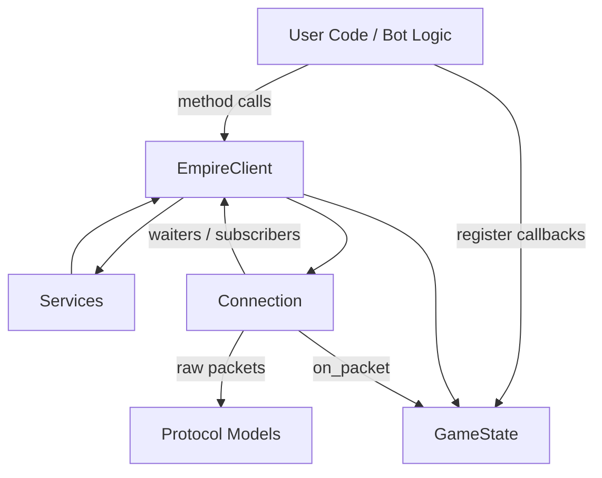

# Architecture Overview

EmpireCore is a layered library. Each layer has a single responsibility and
depends only on the layers below it.

> **Note:** The library is **synchronous and thread-based**, not asyncio. A
> dedicated background thread receives packets so the library never competes
> for a host event loop (e.g. Discord.py) — run blocking calls in a thread
> pool if you need concurrency.

## High-Level Layers

### 1. Network Layer (`empire_core.network`)
* **Responsibility**: the raw WebSocket connection and packet routing.
* **Components**:
    * `Connection`: wraps a `websocket-client` socket. Runs two daemon
      threads — a receive loop and a keepalive loop — tagged with a
      *generation token* so a thread from a previous connection can never
      touch a newer one's state.
    * Routing has three mechanisms:
        * **Waiters** — one-shot request/response. `Connection.request()`
          registers a waiter *before* sending, then blocks for the matching
          command (race-free).
        * **Subscribers** — pub/sub; every matching packet is broadcast to
          all subscribers (e.g. alliance chat).
        * **Global handler** (`on_packet`) — feeds every packet to state.
* **Packets** (`empire_core.protocol.packet.Packet`): parses both the XML
  handshake frames and the `%xt%` extension frames.

### 2. Protocol Layer (`empire_core.protocol`)
* **Responsibility**: the typed grammar of the game protocol.
* **Components**:
    * `BasePayload` / `BaseRequest` / `BaseResponse`: Pydantic v2 models.
      Requests serialize to `%xt%` packets via `to_packet()`; responses parse
      from server payloads.
    * **Registry**: `BaseResponse.__init_subclass__` auto-registers each
      response class by its `command`. Duplicate registration raises;
      `parse_response(command, payload)` dispatches to the right model.
    * `GGECommand`: string constants for known command codes.
    * `errors.GGEError`: enum of server error codes.

### 3. State Layer (`empire_core.state`)
* **Responsibility**: an in-memory snapshot of the current game state.
* **Components**:
    * `GameState`: holds the local player, players, castles, and movements as
      plain dicts, guarded by a lock (it is written by the receive thread and
      read from user threads).
    * Updated **passively** — `update_from_packet()` routes each tracked
      command (`gbd`, `gam`, `dcl`, `mov`, `atv`/`ata`, `mrm`, `sce`, `sei`)
      to a handler that merges the data.
    * Emits **callbacks** for attacks, arrivals, and recalls, dispatched on a
      thread pool so a callback may itself make blocking calls.
* See [state_management.md](state_management.md) and [events.md](events.md).

### 4. Public API (`empire_core.client`, `empire_core.services`)
* **Responsibility**: the user-facing entry point.
* **Components**:
    * `EmpireClient`: the class users instantiate. Runs the login handshake,
      owns the `Connection` and `GameState`, and exposes `send()` / `request()`.
    * **Services** (`client.alliance`, `client.castle`, `client.army`, …):
      high-level, domain-specific APIs, auto-attached at construction. They
      build on `BaseService.request()` (typed response or raise) and
      `execute()` (bool for action success).
    * **Errors**: waiting calls raise typed exceptions from
      `empire_core.exceptions` (`CommandError`, `EmpireTimeoutError`,
      `ConnectionClosedError`, …) rather than returning `None`.
