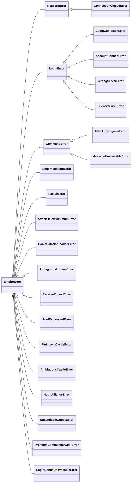

# Error handling

Calls that wait for a reply raise typed exceptions instead of returning
`None`, so a timeout, a dropped connection and a refusal by the server are
told apart. All of them inherit from `EmpireError`.

```python
from empire_core import CommandError, ConnectionClosedError, EmpireTimeoutError, GGEError

try:
    castles = client.castle.get_all()
except CommandError as e:
    print(f"refused: {e.command} code {e.code} ({e.error})")
    if e.error is GGEError.NOT_ENOUGH_RESOURCES:
        ...
except EmpireTimeoutError:
    ...                                             # no reply in time
except ConnectionClosedError:
    ...                                             # dropped while waiting
```

`CommandError.error` is the matching `GGEError` member, or `None` for a code
this library does not know yet, so branch on it instead of on numbers.

## The hierarchy



| Error | When |
|---|---|
| `NetworkError` | `connect()` or a send failed, or a CDN-backed helper could not reach the CDN |
| `ConnectionClosedError` | The connection dropped while a call waited; the error that ended it is its `__cause__` and `client.connection.close_error` |
| `EmpireTimeoutError` | No reply in time; also a builtin `TimeoutError` |
| `CommandError` | The server answered with a non-zero error code |
| `PacketError` | A reply could not be parsed |
| `LoginError` and subclasses | The login failed; see [Getting started](../getting-started.md#log-in) |
| `ReceiveThreadError` | A call that waits for a reply was made on the receive thread |
| `GameDataNotLoadedError` | An API needs `client.load_game_data()` first |
| `AmbiguousLookupError` | A [game-data lookup](game-data.md) matched several rows |
| `AttackBelowMinimumError` | An attack carries fewer units than the client allows |
| `AttackInProgressError` | One of your attacks is already on its way to that target |
| `PoolExhaustedError` | No account in the [pool](multiple-accounts.md) was free |
| `UnknownCastleError` | A castle id, or a source position, is not one of your castles; also a `ValueError` |
| `AmbiguousCastleError` | A castle id or position matches your castles in several kingdoms; also a `LookupError` |
| `NotInAllianceError` | A call about your own alliance, such as `get_local_members()`, while you are in none; also a `LookupError` |
| `UnsendableGoodsError` | A [market send](castle.md#goods-one-tab-per-send) carries goods the client would not send; also a `ValueError` |
| `PremiumCommanderCostError` | A send led by the [premium commander](commanders.md#the-premium-commander) may cost rubies and `spend_rubies` is not set; also a `ValueError` |
| `LoginBonusUnavailableError` | The [login bonus](rewards.md#daily-login-bonus) was asked for below 1200 XP, or before the player data arrived; the server would not answer |

The library does not leak `pydantic.ValidationError` or raw socket exceptions
past its own API: catching `EmpireError` covers everything.

## Actions return `bool`

Action helpers, such as `client.castle.select()` or
`client.equipment.equip()`, return `False` when the server refuses the action
and log the refusal. Transport failures still raise, so an infrastructure
problem is never mistaken for a game-rule refusal.

## `None` means a named not-found

A method returns `None` only where the server answers with an error that
means "nothing there", such as `NO_PLAYER_FOUND` for `client.map.find_next_tower()`
or `NO_SPY_DATA` for `client.spy.get_report()`. Each such method says so in its
docstring; any other error code raises `CommandError`. Invalid arguments raise
`ValueError`, and a reply the library cannot read raises `PacketError`.

Four kinds of method follow rules of their own, each documented on the method:

- State read without a request returns `None` while the login data or push it
  comes from has not arrived: `client.castle.get_horses()` before a `gpc` named
  the castle, `client.state.get_local_player()` before login.
- A call made of several requests returns a result object that names each
  outcome: a `SpyResult` with `SpyOutcome.COMMAND_FAILED` and its `error`, or
  the `failed` and `timed_out` players of `client.player.get_player_details_bulk()`.
- `client.attack.fill_attack()` reads the target on a best-effort basis: a read
  the server refuses is named in the result's `unread`, keyed by `TargetRead`
  with its `CommandError`, so a fill that lacks target data never passes for a
  complete one. A timeout or a dropped connection still raises.
- [`client.rewards.open_activity_chest()`](rewards.md#activity-chest) sends a
  request the server never answers and waits for the push that follows: it
  returns `None` when none came in time, since only that push tells the chest
  opened.

```python
from empire_core import GGEError
from empire_core.combat import TargetRead

attack = client.attack.fill_attack(castle_id, target_x=700, target_y=710)
refusal = attack.unread.get(TargetRead.PRECALCULATION)
if refusal is not None and refusal.error is GGEError.INVALID_AREA:
    ...   # the server would not pre-calculate this target; the map tile filled it
```

## An empty result means nothing there

An empty collection always means "nothing there", never "the lookup failed".
`get_troop_ids()` raises on a CDN outage rather than return an empty list.
Where an exact answer depends on data that may be missing, ask first:

```python
from empire_core import troop_data_available

if not troop_data_available():
    ...   # troop counts would include equipment; treat them as approximate
```

**API:** [Exceptions](../reference/exceptions.md)
