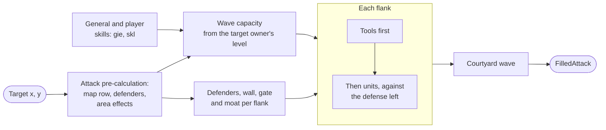

# Filling waves

`client.attack.fill_attack` fills an attack the way the game's own "Fill
waves" button does. Give it your castle, a target and a commander; it reads
everything else itself.

```python
client.load_game_data()    # explicit: the items data is a large download

castle = client.castle.get_all()[0]
commander = client.commanders.get_commanders()[1]

attack = client.attack.fill_attack(
    castle.castle_id,
    target_x=624, target_y=247,          # a target is all it needs
    commander=commander,
)

client.attack.send_attack(
    source_x=castle.x, source_y=castle.y,
    target_x=624, target_y=247,
    waves=attack.waves, yard_wave=attack.yard,
    commander_id=commander.commander_id,
    min_soldiers=attack.min_soldiers,
)
```

`fill_attack` returns a `FilledAttack`: the `waves`, the courtyard wave
`yard`, and `min_soldiers`, the fewest units the waves must carry.

## What it reads

From the coordinates it reads the target's area type and structures, the
defenders each flank holds and the castellan holding it, the area effects that
widen your flanks, your general's skills, and your own legend and Hall of
Legends skills. A camp's level comes from the victory count in its map row; a
player's from the owner records beside it.

Every one of those can be passed instead, and passing one skips the request
that would have found it. The keyword arguments of
[`fill_attack`](../reference/attack.md#empire_core.attack.service.AttackService.fill_attack)
list them all.

The reads are best effort against a refusal: the server refuses the
pre-calculation for a target you may not hit, and the fill goes on with what
the map tile says. Each refused read is named in `FilledAttack.unread`, keyed
by `TargetRead` with the server's `CommandError`, and logged under
`empire_core.attack`: a warning, or info for the pre-calculation's
`INVALID_AREA`. A timeout, a dropped connection or an unreadable reply raises,
and so does a target whose area type has no pre-calculation modelled
(`ValueError`).

```python
attack = client.attack.fill_attack(castle_id, target_x=700, target_y=710)
for read, refusal in attack.unread.items():
    print("filled without", read.value, refusal.error)  # e.g. precalculation GGEError.INVALID_AREA
```



## How the waves are sized

Each wave is sized the way the game sizes it, which is by the *target owner's*
level rather than the attacker's: a level 13 castle holds far fewer troops
than a level 70 one, whatever the attacker's level. Some targets defend at a
level of their own; a monument is built for level 70 however low its owner is.
On top come the commander's own equipment, its general's unit-limit skills,
the Hall of Legends skills, and the legend skills when both sides are at the
level cap.

## How each flank is filled

Each flank takes tools first and then units, because a placed tool reduces the
defense the units are then chosen against.

- **Units** are picked to counter whichever of the target's defenses is
  proportionally weaker.
- **Tools** are picked to cancel the target's wall, gate, moat and defender
  bonuses in as few units as possible, and are skipped entirely where the
  commander's own reductions already erase them. A flank that ends up with
  tools but no units gives the tools back.
- **Fortification is per flank**, not per castle: a defending tool raises only
  the flank it stands on, and only the middle flank meets the gate at all.
- **Tools are filtered by the target**: many may only be carried against
  particular kingdoms and area types, or not against camps.
- **Global effects buff units**: the fill methods read the running ones from
  state, the timers of the `Event.GLOBAL_EFFECT` event, or take your own as
  `global_effects` (`GlobalEffectTimer`s). A timer that has ended counts for
  nothing. The booster's boost to the effects `bie` lists is added from state:
  each such effect's strength plus its `GlobalEffectBuffEvent.boost_value`.

## The courtyard wave

Alongside the waves comes the courtyard wave, the final assault that rides in
the same request. It holds units only, is sized from both levels rather than
the target's alone, and is filled against the defenders of the keep.

## The minimum

An attack's waves must carry at least a tenth of what one wave holds at the
target's level (8 units against a level 16 castle, 32 from level 70), as the
game client requires. The server refused fewer on a player's castle with
`MOVEMENT_HAS_NO_UNITS` (100); whether it enforces this on NPC camps is not yet
known.

- `fill_attack` raises `AttackBelowMinimumError` when the castle cannot reach
  it.
- `send_attack` checks it before sending when given `min_soldiers` or a
  `capacity`.
- `empire_core.combat.min_attack_soldiers(target_owner_level, area_type)` works
  it out for any target.

## Runnable example

```python title="examples/fill_waves.py"
--8<-- "examples/fill_waves.py"
```

**API:** [`AttackService.fill_attack`](../reference/attack.md#empire_core.attack.service.AttackService.fill_attack),
[`combat`](../reference/combat.md)
