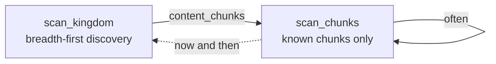

# Map scanning

`client.map.scan_kingdom` finds a kingdom's castles, outposts, capitals and
other map objects. It discovers the kingdom breadth-first from your castle's
position, and a full scan can take a few minutes.

```python
from empire_core import Kingdom, MapItemType

result = client.map.scan_kingdom(Kingdom.GREEN, item_types=[MapItemType.CASTLE])
print(f"{len(result.items)} items, {len(result.failed_chunks)} failed chunks")
```

!!! danger "Always check `failed_chunks`"

    A partial scan is not an empty kingdom, and only this field tells them
    apart.

## What a scan returns

A `ScanResult` holds:

| Field | What it is |
|---|---|
| `items` | Every `MapAreaItem` found, read by its area type's layout. |
| `objects` | The map objects by id. |
| `kingdom` | The kingdom scanned; every item carries it too. |
| `failed_chunks` | Chunks that still failed after their retries. |
| `content_chunks` | Chunks that answered and held items. |

An item's `owner_id` is below 0 for an NPC owner. `NPCOwner` (in
`empire_core.enums`) names those ids, e.g. `NPCOwner.ROBBER_BARON` or
`NPCOwner.OUTPOST` for an unclaimed outpost.

Requests go out back to back, as the game client sends its map requests; a
live scan of 289 chunks at about 17 requests a second ran without a refusal.
A chunk that times out, or is refused with a cooldown, is retried after a short
backoff. `chunk_delay` adds a fixed wait before every request if you want one.

## Re-scanning cheaply

Feed `content_chunks` back into `scan_chunks()` to re-scan a known region
without paying for the breadth-first discovery again, which takes roughly a
third fewer requests. Run a full `scan_kingdom()` now and then to pick up
content in chunks that were empty before.

```python
discovery = client.map.scan_kingdom(Kingdom.GREEN, item_types=[MapItemType.CASTLE])

fresh = client.map.scan_chunks(
    Kingdom.GREEN, list(discovery.content_chunks), item_types=[MapItemType.CASTLE]
)
```



For very frequent scans, split `content_chunks` across several logged-in
accounts, in interleaved slices `chunks[i::n]`, and run their `scan_chunks()`
calls at the same time. The server limits the request rate per account; see
[Multiple accounts](multiple-accounts.md).

## The session leaves its castle

A scan moves the session off the castle it had joined. `client.army` methods
join their castle again themselves; anything else castle-scoped needs
`client.castle.select()` first.

## Other map calls

- `client.map.find_next(area_type)` finds the nearest object of one area type,
  with the map rows around it.
- `client.map.scan_map_area(x1, y1, x2, y2)` reads one rectangle of the map.
- `client.castle.join_area(x, y)` joins an outpost, capital, metropolis or
  faction camp by its position.

## Runnable example

```python title="examples/kingdom_scan.py"
--8<-- "examples/kingdom_scan.py"
```

**API:** [`MapService`](../reference/map.md#empire_core.map.service.MapService),
[`ScanResult`](../reference/map.md#empire_core.map.scanner.ScanResult),
[`MapAreaItem`](../reference/map.md#empire_core.map.models.items.MapAreaItem)
