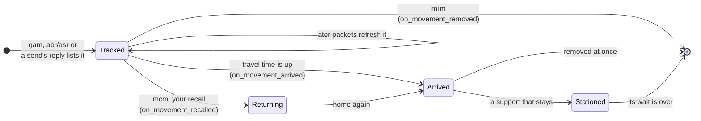

# Reacting to movements

Every army on the move is a `Movement` in `client.state`. Register callbacks
on the state to react as movements appear, arrive, turn back or vanish.

```python
def on_attack(movement):
    print(f"{movement.troop_count} troops from {movement.source_player_name}, "
          f"{movement.time_remaining}s out")

def on_arrived(movement_id, movement):
    print(f"{movement_id} arrived: {movement}")

client.state.on_incoming_attack(on_attack)
client.state.on_movement_arrived(on_arrived)
```

| Register | Fires | Remove with |
|---|---|---|
| `on_incoming_attack(cb)` | Once per newly seen hostile attack | `remove_incoming_attack_callback` |
| `on_incoming_attack_updated(cb)` | When a later packet changes an announced attack | `remove_incoming_attack_updated_callback` |
| `on_incoming_attack_withdrawn(cb)` | When the server removes an announced attack before it arrives | `remove_incoming_attack_withdrawn_callback` |
| `on_movement_arrived(cb)` | Once a movement's travel time is up | `remove_movement_arrived_callback` |
| `on_movement_recalled(cb)` | On the reply to your own recall | `remove_movement_recalled_callback` |
| `on_movement_removed(cb)` | When the server removes a movement (`mrm`) | `remove_movement_removed_callback` |

## A movement's life



- **Incoming attacks.** `on_incoming_attack` fires once per attack movement
  that is not your own, is not on its way home and had not already landed when
  first seen, and that is aimed at you or the daimyo township (whoever sends
  it; an alien attack only at you) or at another member of your alliance. On
  an alliance member it fires for a player's attack, an alien attack, the
  alliance nomad camp, and NPCs that are not dungeon owners (outpost, capital
  and metropolis owners, the plague monk, NPC ids the client does not know);
  robber barons, camps, event dungeons and other dungeon owners do not fire
  it. `NPCOwner` names these NPC owner ids, e.g. `NPCOwner.DAIMYO_TOWNSHIP`
  and `NPCOwner.ALLIANCE_NOMAD_CAMP`. An alliance member's attack on someone outside the alliance does not
  fire. An attack whose attacker's record comes in a later packet fires then.
  It does not fire again on later refreshes, nor when a reconnect lists the
  same attack again.
- **Arrival.** The server sends no arrival packet: as in the game client, a
  movement arrives once its travel time is up. The check runs on every packet
  and every movement query, so the callback fires with the first of those
  after the arrival. A movement first seen after it arrived does not fire.
- **Stationed supports.** An army that stays at its target is kept in state
  until its wait is over; every other movement is removed before the arrival
  callbacks run.
- **The way home.** An army's way home is a movement of its own, so
  `on_movement_arrived` fires again when the army gets back. Check
  `movement.is_returning` to tell the two apart.
- **Removal.** `mrm` does not say why: a battle ending, a finished recall and a
  support sent home all look the same.
- **Updated attacks.** `on_incoming_attack_updated(old, new)` fires when a
  later packet for an announced attack changes its army (`units`,
  `estimated_size`), its arrival (`estimated_arrival`, by two seconds or more,
  as a speed-up does), its target (`target_id`, `target_area_id`, `target_x`,
  `target_y`) or its commander (`commander`, its equipment and area effects
  included). `old` is the attack as state had it before the packet.
  A packet that changes none of these does not fire it, and neither does the
  packet that announces the attack. Units, the size estimate and the
  commander a later packet leaves out are kept from the earlier one.
- **Withdrawn attacks.** When `mrm` removes an attack that `on_incoming_attack`
  announced and its travel time is not up yet, `on_incoming_attack_withdrawn`
  fires with the attack, after `on_movement_removed`. Use it to retract an
  alert. It is derived from the arrival time, not reported: neither the server
  nor the game client says why a movement is removed. An attack removed within
  two seconds of its `estimated_arrival` (which can run a second late), at or
  after it, or one state no longer tracks, does not fire.

## Callback signatures

`on_incoming_attack` and `on_incoming_attack_withdrawn` callbacks take the
`Movement`, `on_incoming_attack_updated` callbacks the old and the new one.
Arrival, recall and removal callbacks take either the movement id alone or the
id and the `Movement`:

```python
def on_removed(movement_id): ...
def on_removed(movement_id, movement): ...    # prefer this form
```

Prefer the two-argument form. An arrived or removed movement is usually gone
from state before the callback runs, so the id alone can no longer be
resolved. `movement` is `None` only when the server removes a movement state
never tracked.

## Which thread callbacks run on

State callbacks run one at a time on a single callback thread, in the order
their packets arrived, never on the receive thread. A callback may make a
request and wait for its reply, but every callback queued behind it waits too,
so hand long work to another thread.

The callbacks survive a disconnect and keep working after the next login. When
the connection drops, state is emptied until the login refills it; see
[Disconnects](game-state.md#disconnects).

## The attacker's commander

A movement that carries its commander (the `UM` block, as an attack does) keeps
it whole in `movement.commander`, the same `Commander` model as a `gli` roster
entry; the game client builds both with one factory. Its bonuses resolve the
same way too, equipment set bonuses included. A default commander (a negative
`commander_id`, such as the bought premium commander, -14, or a robber baron
attack's, -15) resolves to its `lords` row's effects in the game data instead
of equipment.

```python
from empire_core.combat import EffectResolver, attacker_flank_effects, commander_bonuses
from empire_core.gamedata import GameData

game_data = GameData.load()
resolver = EffectResolver(game_data)

def on_attack(movement):
    if movement.commander is None:
        return
    bonuses = commander_bonuses(game_data, movement.commander)
    effects = attacker_flank_effects(
        resolver, bonuses, area_type=movement.target_type, player_target=True
    )
    print(effects.melee_bonus, effects.range_bonus, effects.wall_reduction)
    print(resolver.yard_capacity_bonus(bonuses, area_type=movement.target_type, player_target=True))
```

`attacker_flank_effects` gives the multipliers and the wall, gate and moat
reductions the game uses for the fight; a `target_type` of -1 (no target area)
keeps every effect, as the game does. `resolver.yard_capacity_bonus` and
`yard_capacity_boost` are the courtyard additions that `yard_capacity` takes.

`player_target=True` because the attack is on a player, you or an alliance
member: the game client picks the effect filter from the owner of the
movement's target
(`LordEffectHelper.getFilterStrategyByMovementVO`). A player's castle gets the
player-versus-player attack filter, which leaves out the effects flagged for
NPC fights only.

The movement's commander comes with the area effects (`AE`) of the castle it
was sent from. So it matches a roster commander resolved with that castle's
`aci` area effects, passed as `area_effects=` to `commander_bonuses`, not the
bare `gli` entry.

`commander_bonuses` leaves the general's passive effects out, as the game's
movement tooltip does; `attack_dialog_bonuses` with the commander's
`general_skill_ids` adds them. Legend skills belong to the attacking player and
a movement does not carry them.

## Asking for movements

```python
movements = client.movements.get_movements()       # asks the server
attacks = client.movements.get_incoming_attacks()   # reads state
client.movements.recall(movement_id)
```

`recall` works on your own movements that are still heading to their target
(attacks only within 600 seconds of leaving, with exceptions) and your
supports in either direction.

**API:** [`MovementsService`](../reference/movements.md#empire_core.movements.service.MovementsService),
[`Movement`](../reference/movements.md#empire_core.movements.tracked.Movement)
