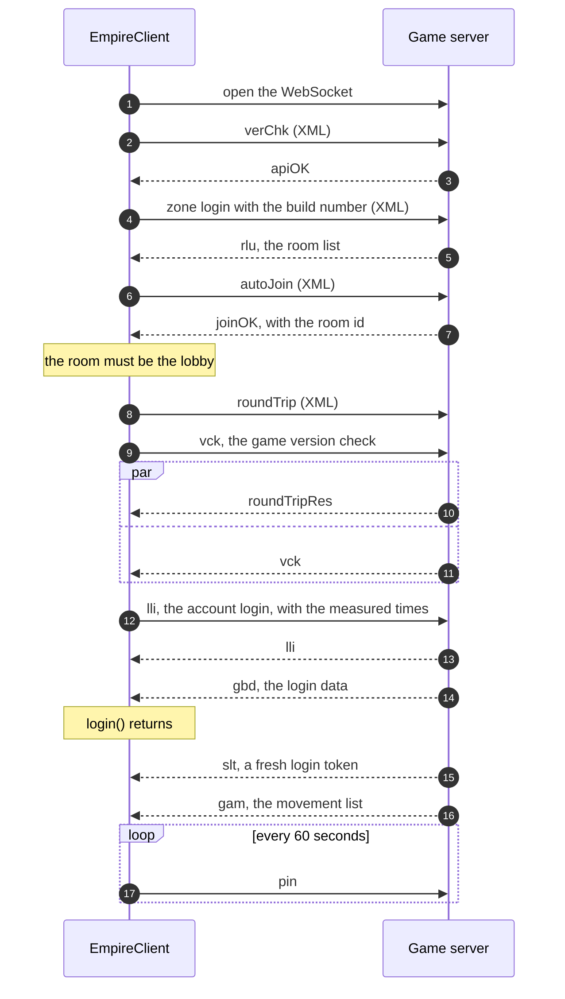
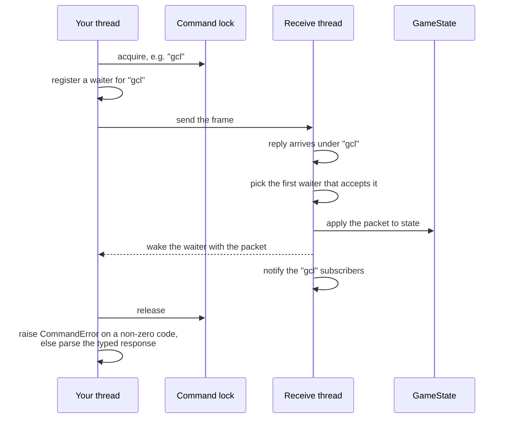
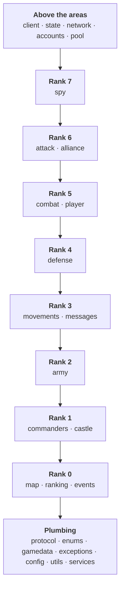

# Login and requests

## The login handshake

`client.login()` runs the same exchange as the game's HTML5 client, step for
step. The XML messages are SmartFox system messages; the rest are `%xt%`
extension messages.

- `joinOK`'s room id goes into every `%xt%` message after it.
- `vck` refused with code 1 or 2 raises `ClientVersionError`; set
  `EmpireConfig.client_version` to the current client's version.
- `lli` sends the connection time and the round-trip time the client measured,
  and either the password or a login token.
- A refused `lli` raises a typed `LoginError`: `LoginCooldownError`,
  `AccountBannedError`, `WrongServerError`, or `LoginError` itself.
- `login()` waits for `gbd`, which fills the player and castles in state.
  `slt` and `gam` arrive just after it; `client.login_token` is updated from
  `slt`.
- Any failure closes the connection and its threads before the error reaches
  you.

## Requests and replies

Most replies do not say which request they answer; they only carry the command
id. So a request holds a per-command lock from before it is sent until its
reply arrives, and at most one request per command id is in flight.

- The waiter is registered **before** the send, so an immediate reply cannot
  be missed.
- State is updated **before** the waiter wakes, so reading state right after a
  request sees what the reply carried.
- Some request models can check that a reply is theirs (`accepts_reply`); for
  those, replies about something else pass to state and subscribers without
  being taken. Error replies carry nothing to check and always go to the
  oldest waiter.
- Time spent waiting for the lock counts against the call's `timeout`.
- The receive thread never waits for a reply itself: a waiting call made on it
  raises `ReceiveThreadError`. Alliance chat callbacks and connection
  subscribers run there; state callbacks run on their own callback thread.

## The package layers

The library is organised by game area. Arrows point down, toward what a layer
may import: an area imports only areas of a lower rank, the shared plumbing at
the bottom imports no area, and the client, state and network sit above them all.
`tests/test_layers.py` checks every import against these ranks.

Each area package holds its models (a `models.py` or a `models/` package) and,
where the game has one, a `service.py` reached as `client.<area>`. An area's
`__init__` exports its models but never imports its service.
`empire_core.protocol.models` re-exports every area's models for your
convenience; the library itself imports models from their area.
